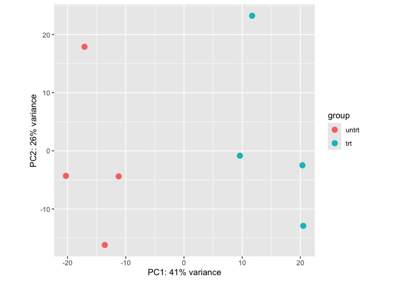
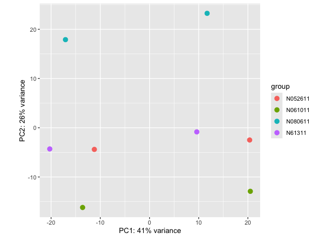
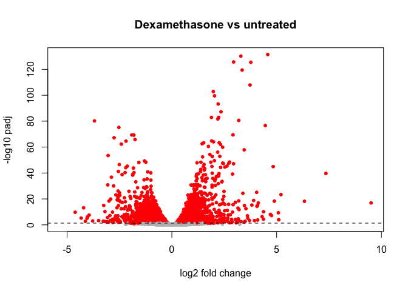

Dexamethasone response in airway cells (DESeq2)
================

Which genes does dexamethasone switch on or off in human airway smooth
muscle cells? Data: the Bioconductor `airway` dataset (4 donor cell
lines, each untreated or treated). Methods: differential expression with
DESeq2 (`~ cell + dex`), VST + PCA for quality control, and
Benjamini–Hochberg FDR \< 0.05.

Requires DESeq2 and airway from Bioconductor; knit the Rmd to reproduce.

``` r
library(DESeq2); library(airway)
data(airway)
```

## 1. Set up and run

``` r
# Build the DESeq2 object (counts + sample info + design).
# ~ cell + dex: test dex while accounting for differences between cell lines.
dds <- DESeqDataSet(airway, design = ~ cell + dex)

# Make untreated the baseline so log2FC = trt vs untrt.
# (Default is alphabetical, which makes "trt" the baseline and flips the signs.)
dds$dex <- relevel(dds$dex, ref = "untrt")

# Check the design: 4 cell lines x 2 treatments, 1 sample each
table(dds$cell, dds$dex)
```

    ##          
    ##           untrt trt
    ##   N052611     1   1
    ##   N061011     1   1
    ##   N080611     1   1
    ##   N61311      1   1

``` r
levels(dds$dex)   # check that "untrt" is listed first = reference
```

    ## [1] "untrt" "trt"

``` r
# Normalize, estimate dispersions, then fit and test every gene
dds <- DESeq(dds)
```

## 2. Quality check: do samples separate by treatment and donor?

``` r
# vst: normalize by size factor + log2-like transform so every gene contributes fairly.
# PCA: check whether samples group by treatment (1st plot) and by donor (2nd plot).
plotPCA(vst(dds), intgroup = "dex")
```

<!-- -->

``` r
plotPCA(vst(dds), intgroup = "cell")
```

<!-- -->

## 3. Results

``` r
# Results table: one row per gene (log2FC, p-value, padj). alpha = FDR cutoff of 0.05.
res <- results(dds, alpha = 0.05)

# Add gene symbols: match each Ensembl ID to the gene table and copy its symbol.
res$symbol <- rowData(airway)[rownames(res), "symbol"]

# Number of genes up/down at padj < 0.05
summary(res)
```

    ## 
    ## out of 33469 with nonzero total read count
    ## adjusted p-value < 0.05
    ## LFC > 0 (up)       : 2211, 6.6%
    ## LFC < 0 (down)     : 1817, 5.4%
    ## outliers [1]       : 0, 0%
    ## low counts [2]     : 16687, 50%
    ## (mean count < 7)
    ## [1] see 'cooksCutoff' argument of ?results
    ## [2] see 'independentFiltering' argument of ?results

``` r
# Top 10 genes, most significant first
head(res[order(res$padj), c("symbol", "log2FoldChange", "padj")], 10)
```

    ## log2 fold change (MLE): dex trt vs untrt 
    ##  
    ## DataFrame with 10 rows and 3 columns
    ##                      symbol log2FoldChange         padj
    ##                 <character>      <numeric>    <numeric>
    ## ENSG00000152583     SPARCL1        4.57492 3.72950e-132
    ## ENSG00000165995      CACNB2        3.29106 6.57834e-131
    ## ENSG00000120129       DUSP1        2.94781 2.05150e-126
    ## ENSG00000101347      SAMHD1        3.76700 4.02027e-126
    ## ENSG00000189221        MAOA        3.35358 3.68993e-120
    ## ENSG00000211445        GPX3        3.73040 1.29169e-108
    ## ENSG00000157214      STEAP2        1.97677 1.38309e-103
    ## ENSG00000162614        NEXN        2.03567 2.77689e-100
    ## ENSG00000125148        MT2A        2.21098  5.41165e-94
    ## ENSG00000154734     ADAMTS1        2.34560  5.47002e-88

## 4. Sanity check on known dexamethasone responders

DUSP1, KLF15 and PER1 are well-known glucocorticoid-responsive genes, so
they should all be upregulated.

``` r
# Look up by Ensembl ID: DUSP1, KLF15, PER1. Expect positive log2FC and small padj.
res[c("ENSG00000120129", "ENSG00000163884", "ENSG00000179094"),
    c("symbol", "log2FoldChange", "padj")]
```

    ## log2 fold change (MLE): dex trt vs untrt 
    ##  
    ## DataFrame with 3 rows and 3 columns
    ##                      symbol log2FoldChange         padj
    ##                 <character>      <numeric>    <numeric>
    ## ENSG00000120129       DUSP1        2.94781 2.05150e-126
    ## ENSG00000163884       KLF15        4.45913  2.33436e-77
    ## ENSG00000179094        PER1        3.19175  2.54258e-81

## 5. Volcano plot

``` r
# x = effect size (log2FC), y = significance (-log10 padj); red = padj < 0.05.
# Genes with padj = NA (filtered for low counts) are not plotted.
plot(res$log2FoldChange, -log10(res$padj), pch = 20,
     main = "Dexamethasone vs untreated",
     col = ifelse(res$padj < 0.05, "red", "grey"),
     xlab = "log2 fold change", ylab = "-log10 padj")
abline(h = -log10(0.05), lty = 2) # dashed line = padj 0.05 threshold
```

<!-- -->

## Takeaways

The PCA plots show treated and untreated samples separate along PC1 and
donors separate along PC2, so dexamethasone is the main source of
variation between samples, followed by donor differences. Of 33,469
genes with nonzero read counts, 4,028 changed at padj \< 0.05: 2,211
upregulated and 1,817 downregulated. Known responders to dexamethasone
DUSP1, KLF15, PER1 were all upregulated (log2FC around 3–4.5), which
confirms that the analysis captures expected biology. The volcano plot
shows significantly affected genes in red and non-significant changes in
gray.

## Session info

``` r
# R and package versions used, for reproducibility
sessionInfo()
```

    ## R version 4.6.1 (2026-06-24)
    ## Platform: aarch64-apple-darwin23
    ## Running under: macOS Tahoe 26.0.1
    ## 
    ## Matrix products: default
    ## BLAS:   /Library/Frameworks/R.framework/Versions/4.6/Resources/lib/libRblas.0.dylib 
    ## LAPACK: /Library/Frameworks/R.framework/Versions/4.6/Resources/lib/libRlapack.dylib;  LAPACK version 3.12.1
    ## 
    ## locale:
    ## [1] en_US.UTF-8/en_US.UTF-8/en_US.UTF-8/C/en_US.UTF-8/en_US.UTF-8
    ## 
    ## time zone: America/New_York
    ## tzcode source: internal
    ## 
    ## attached base packages:
    ## [1] stats4    stats     graphics  grDevices utils     datasets  methods  
    ## [8] base     
    ## 
    ## other attached packages:
    ##  [1] airway_1.32.0               DESeq2_1.52.0              
    ##  [3] SummarizedExperiment_1.42.0 Biobase_2.72.0             
    ##  [5] MatrixGenerics_1.24.0       matrixStats_1.5.0          
    ##  [7] GenomicRanges_1.64.0        Seqinfo_1.2.0              
    ##  [9] IRanges_2.46.0              S4Vectors_0.50.3           
    ## [11] BiocGenerics_0.58.1         generics_0.1.4             
    ## 
    ## loaded via a namespace (and not attached):
    ##  [1] SparseArray_1.12.3  lattice_0.23-1      digest_0.6.39      
    ##  [4] magrittr_2.0.5      evaluate_1.0.5      grid_4.6.1         
    ##  [7] RColorBrewer_1.1-3  fastmap_1.2.0       Matrix_1.7-6       
    ## [10] scales_1.4.0        codetools_0.2-20    abind_1.4-8        
    ## [13] cli_3.6.6           rlang_1.3.0         XVector_0.52.0     
    ## [16] withr_3.0.3         DelayedArray_0.38.2 yaml_2.3.12        
    ## [19] otel_0.2.0          S4Arrays_1.12.1     tools_4.6.1        
    ## [22] parallel_4.6.1      BiocParallel_1.46.0 dplyr_1.2.1        
    ## [25] ggplot2_4.0.3       locfit_1.5-9.12     vctrs_0.7.3        
    ## [28] R6_2.6.1            lifecycle_1.0.5     pkgconfig_2.0.3    
    ## [31] pillar_1.11.1       gtable_0.3.6        glue_1.8.1         
    ## [34] Rcpp_1.1.2          xfun_0.61           tibble_3.3.1       
    ## [37] tidyselect_1.2.1    rstudioapi_0.19.0   knitr_1.52         
    ## [40] farver_2.1.2        htmltools_0.5.9     labeling_0.4.3     
    ## [43] rmarkdown_2.32      compiler_4.6.1      S7_0.2.2
